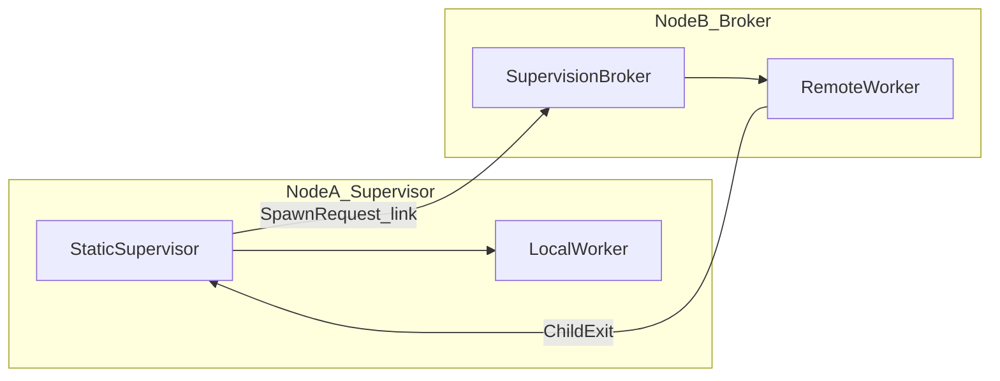

# Production Readiness

**Last updated:** after Phase 12.7 (static supervisor remote placement).

Spawned is a Rust actor framework inspired by Erlang OTP. This document summarizes **what you can build today**, **known limitations**, and the **path to v1.0 production completion**.

For phase-by-phase history, see [ROADMAP.md](ROADMAP.md). For clustering details, see [CLUSTERING.md](CLUSTERING.md).

---

## Executive summary

**Spawned is production-ready today for:**

- Single-node supervised services (HTTP workers, job pools, nested supervisor trees)
- Cluster RPC and federated discovery (`RemoteActorRef`, registry, distributed pg)
- **Supervised remote worker pools** — static supervisor on node A with declarative local + remote children (Phase 12.7)

**Spawned is not yet production-complete for:**

- Location-transparent “spawn anywhere” distributed actors
- Cross-node graceful shutdown with wait/timeout guarantees
- Full OTP parity (group monitors, persistence, hot code upgrade, `gen_statem`)
- Enterprise ops out of the box (TLS/mTLS, rich metrics, partition chaos validation)

**v1.0 target:** **Tier 2 — Operable production** (see [Production tiers](#production-tiers) below).

---

## Capability matrix

### Local actor runtime

| Area | Status | Key APIs |
|------|--------|----------|
| Actor lifecycle | Shipped | `Actor`, `Handler<M>`, `Context` — tasks + threads |
| Type-safe messaging | Shipped | `ActorRef`, `Recipient`, `#[protocol]` / `#[actor]` |
| Mailboxes + backpressure | Shipped | `MailboxConfig`, default bounded workers (64), fail-fast |
| Priority dequeue | Shipped | Signal > Stop > Supervision > Message |
| Timers + streams | Shipped | `send_after`, `send_interval`, streams |
| OS signal shutdown | Shipped | `Application`, `shutdown_on_signal` |

**Examples:** [`http_workers`](../examples/http_workers), [`supervised_workers`](../examples/supervised_workers), [`pg_workers`](../examples/pg_workers)

### Supervision (local)

| Area | Status | Notes |
|------|--------|-------|
| Static supervisor | Shipped | OneForOne / OneForAll / RestForOne, meltdown, backoff |
| Dynamic supervisor | Shipped | **OneForOne only** (`simple_one_for_one`) |
| Monitors + links | Shipped | Local + cross-node (Phases 12.5 / 12.6) |
| Child specs | Shipped | Restart/shutdown/mailbox/pg auto-join |
| Application wrapper | Shipped | Root lifecycle + optional cluster `Node` |

**Examples:** [`supervised_workers`](../examples/supervised_workers), [`dynamic_workers`](../examples/dynamic_workers)

### Clustering + distribution



| Area | Status | Notes |
|------|--------|-------|
| Address + wire | Shipped | `ActorAddress`, protocol v3, postcard |
| TCP + libp2p transport | Shipped | `Node::builder()`, `cluster-libp2p` feature |
| Remote messaging | Shipped | `RemoteActorRef`, async requests |
| Federated registry | Shipped | `register_named`, `lookup_address` |
| Distributed pg | Shipped | `cast_federated`, `member_addresses` |
| Remote spawn | Shipped | `register_remote_worker/spec`, `DynamicSupervisor::start_child_remote` |
| Remote supervision loop | Shipped | ChildExit, remote restart, monitor/link propagation |
| Static remote placement | Shipped (12.7) | `ChildSpec::remote_named`, `remote_worker` |

**Examples:** [`cluster_ping_pong`](../examples/cluster_ping_pong), [`cluster_supervised_workers`](../examples/cluster_supervised_workers), [`http_workers`](../examples/http_workers)

**Integration tests:** `concurrency/tests/supervision_*_two_node.rs`, `cluster/tests/*_two_node.rs`

---

## Supported app patterns

| Pattern | Building blocks | Starting point |
|---------|-----------------|----------------|
| HTTP / job worker pool (single node) | `Application` + `ActorPool` + bounded mailboxes | [`http_workers`](../examples/http_workers) |
| Supervised service tree (single node) | `Supervisor` + `ChildSpec::worker/supervisor` | [`supervised_workers`](../examples/supervised_workers) |
| Runtime connection/session pool | `DynamicSupervisor` + pg | [`dynamic_workers`](../examples/dynamic_workers) |
| Cluster RPC / discovery | `Node` + `register_named` + `RemoteActorRef` | [`cluster_ping_pong`](../examples/cluster_ping_pong) |
| Supervised remote workers | Static supervisor + `remote_worker` / `remote_named` | [`cluster_supervised_workers`](../examples/cluster_supervised_workers) |
| Federated broadcast | pg + `cast_federated` + `ActorPool::dispatch_federated` | [`pg_workers`](../examples/pg_workers) + [CLUSTERING.md](CLUSTERING.md) |

---

## Sharp edges and workarounds

### Clustering / supervision

| Limitation | Impact | Workaround |
|------------|--------|------------|
| Remote shutdown is signal-only | Supervisor cannot block until remote child exits | Design for eventual consistency; use `ChildExit` for restart decisions |
| Mixed local+remote batch terminate | OneForAll/RestForOne may complete after async remote exits | Allow extra time before assuming batch done; see [SUPERVISION.md](SUPERVISION.md) |
| Explicit placement only | You choose target `NodeId` | Register workers on known nodes; use federated registry for discovery |
| No nested remote supervisor subtrees | Cannot spawn whole remote tree as one child | Flatten: remote workers only, supervisor stays on home node |
| `DynamicSupervisor` OneForOne only | No runtime OneForAll pools | Use static `Supervisor` for batch-restart trees |
| `ctx.actor_address()` on remote node | Returns `local_node()` (process-global) | Use spawn RPC return address or `ActorAddress::on(node, id)` for signals |

### OTP parity gaps

- pg **group monitors** — no membership-change notifications yet
- **Interruptible shutdown** — `kill()` does not preempt in-flight handlers
- Hot code upgrade / child spec migration — not supported
- Persistence / event sourcing — not started
- `gen_statem`-style state machines — not started
- Location-transparent distributed actors — distinct from explicit remote placement (12.7)

### Ops / maturity

- Library version **v0.5**; cluster wire protocol **v3**
- Integration tests are mostly **single-process two-node**
- No built-in cluster **TLS/mTLS/auth** — bring your own network security
- Observability: mailbox depth yes; supervision metrics / latency tracing thin

### Operational tips

- Use **`SupervisionSignal::Stop`** (not `Kill`) when testing remote trap/exit paths
- Call **`install_tasks_runtime`** on worker nodes before starting the TCP listener
- Register remote workers **before** starting nodes: `register_remote_worker` / `register_remote_spec`
- Set **`SPAWNED_NODE_NAME`** (or use `Node::builder().name(...)`) consistently per process

---

## Production tiers

| Tier | Definition | Audience |
|------|------------|----------|
| **Tier 1: Clustered supervision MVP** | Documented remote supervisor trees, runnable example, caveats documented | Teams shipping supervised remote worker pools |
| **Tier 2: Operable production** | Tier 1 + observability, hardened remote shutdown, multi-node test matrix | Teams with SLOs and on-call runbooks |
| **Tier 3: OTP-grade platform** | Tier 2 + group monitors, dynamic supervisor strategies, optional persistence | Full Erlang/OTP parity |

**v1.0 goal:** Tier 2.

---

## Roadmap to v1.0

### Phase 12.8 — Documentation + example (current)

- [x] This document (`PRODUCTION_READINESS.md`)
- [x] ROADMAP production path section
- [x] API-GUIDE + SUPERVISION remote child spec docs
- [x] [`cluster_supervised_workers`](../examples/cluster_supervised_workers) example

**Acceptance:** New users can run the clustered supervisor example and find `remote_*` APIs in API-GUIDE without reading source.

### Phase 13 — Operational hardening

| Item | Rationale | Touch points |
|------|-----------|--------------|
| Cross-node shutdown wait | Graceful drain of remote children with timeout | `supervision_remote.rs`, supervisor `terminate_children` / `stopped` |
| Batch terminate semantics | Tighten or document mixed local+remote completion | `tasks/supervisor.rs`, `threads/supervisor.rs` |
| Remote spawn failure policy | Retry/backoff on transport errors during restart | Supervisor restart path |
| Wire protocol stability policy | Breaking-change rules for v3+ | CLUSTERING.md, CHANGELOG |

### Phase 14 — Observability

| Item | Rationale | Approach |
|------|-----------|----------|
| Supervision event tracing | Debug restarts/meltdown/remotes | `tracing` spans on supervisor + broker |
| Metrics hooks | Restart counts, remote spawn latency | Optional `metrics` feature or tracing-only MVP |
| Health / readiness | Orchestrator liveness | `Node` broker-ready check |

### Phase 15 — Production validation

| Item | Rationale |
|------|-----------|
| Multi-node tests (3+ nodes) | Registry/routing edge cases |
| Partition / reconnect scenarios | TCP drop mid-spawn, mid-request |
| libp2p supervision parity | Same tests on `cluster-libp2p` |
| Load / soak test (optional) | Remote spawn + request throughput baseline |

### Phase 16 — v1.0 stabilization

| Item | Rationale |
|------|-----------|
| Semver / API stability commitment | Upgrade path for adopters |
| CHANGELOG + protocol v3 migration guide | Cluster upgrades |
| Stale doc sweep | Remove outdated “deferred” notes |
| Security posture doc | TLS/mTLS recommendations |

### Post-1.0 (Tier 3)

Not blocking v1.0 — track in [ROADMAP.md](ROADMAP.md) Future Considerations:

- pg group monitors
- DynamicSupervisor OneForAll / RestForOne
- Nested remote supervisor subtrees
- Persistence / event sourcing
- `gen_statem`
- Location-transparent distributed actors

---

## Decision guide

**Use Spawned today if:**

- You want Erlang-style supervision in Rust (local or clustered)
- You need typed actors with async or thread execution modes
- You can accept explicit node placement for remote workers
- You bring your own observability stack (`tracing` integrates today)

**Wait or plan extra work if:**

- You need location-transparent spawn (no explicit `NodeId`)
- You require synchronous cross-node shutdown guarantees
- You need Akka Persistence–style event sourcing
- You require battle-tested partition tolerance at scale (validate in Phase 15 first)

**Single node vs cluster:**

```text
Need supervision only, one process?     → Supervisor + Application (no cluster feature)
Need RPC across nodes?                → Node + RemoteActorRef + register_named
Need supervised workers on other nodes? → ChildSpec::remote_worker + register_remote_worker
Need runtime pools?                   → DynamicSupervisor (local) or remote spawn via API
```

---

## Related docs

| Document | Contents |
|----------|----------|
| [ROADMAP.md](ROADMAP.md) | Phase history + production path summary |
| [CLUSTERING.md](CLUSTERING.md) | Wire protocol, Node bootstrap, supervision control plane |
| [SUPERVISION.md](SUPERVISION.md) | Static/dynamic supervisors, remote children, batch terminate |
| [API-GUIDE.md](API-GUIDE.md) | Type and method reference |
| [examples/README.md](../examples/README.md) | Runnable demos |
